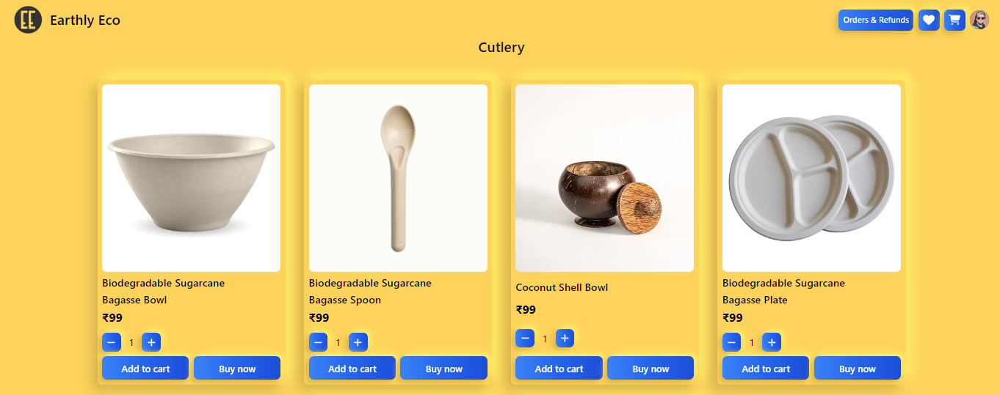
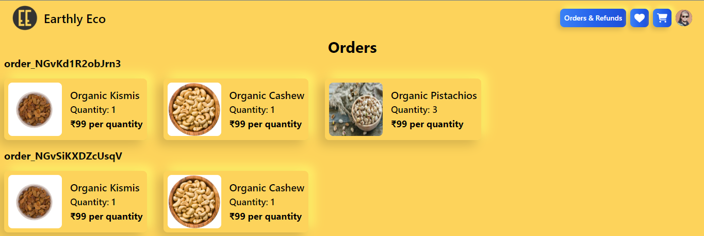
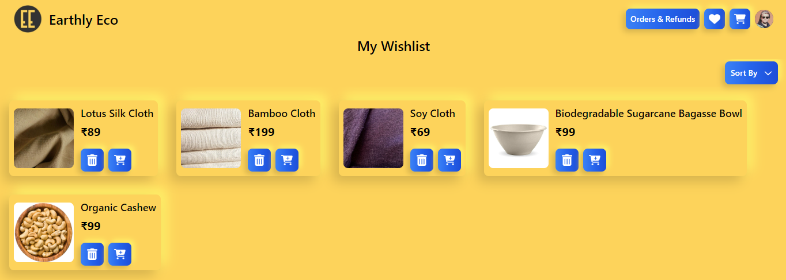
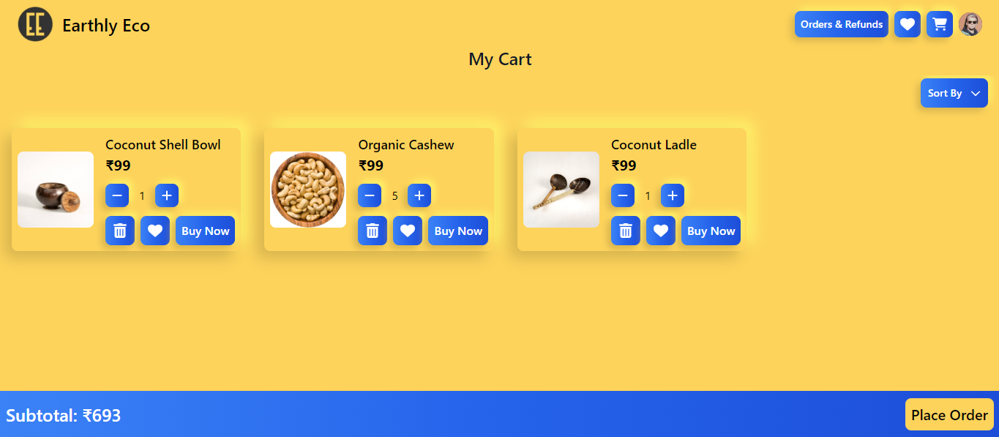
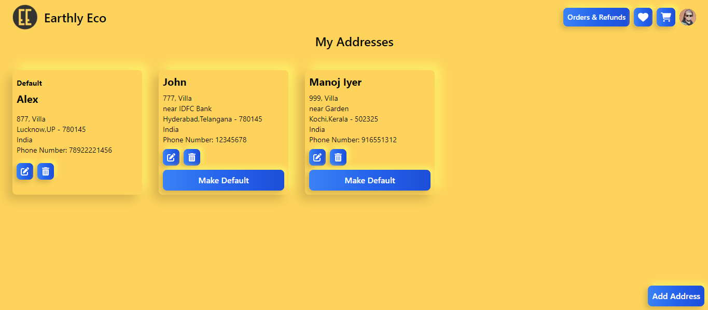
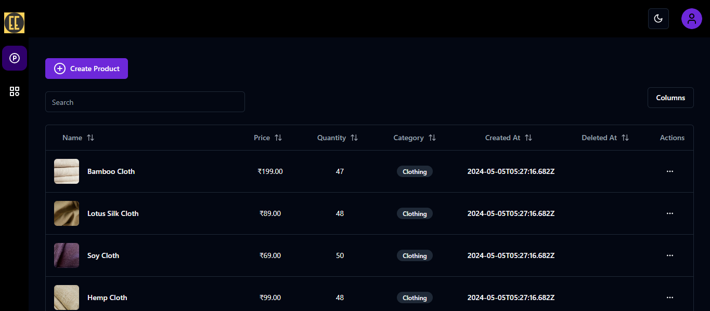
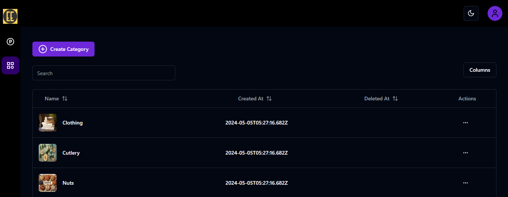
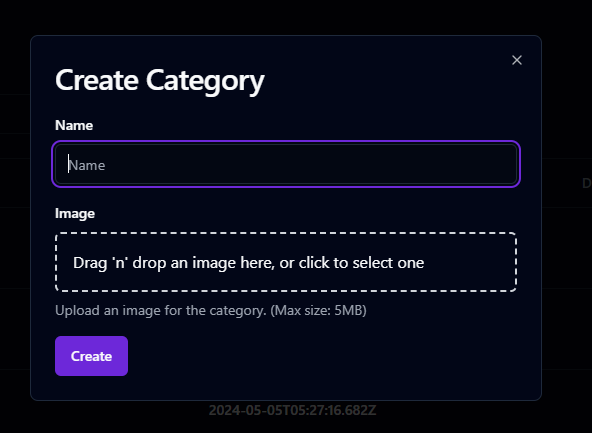

# EarthlyEco - Your Sustainable Ecommerce Destination

### Overview

This is an ecommerce application built using React, Redux, TypeScript, Node.js, Express.js, Firebase, and Python. The application facilitates various features such as managing categories and products, adding products to cart and wishlist, purchasing products individually or via cart, managing orders and payments through Razorpay, and providing admin functionalities for category and product management.

<p align="center">
  
</p>

### Features

- **Categories and Products:** Browse through various categories and products.
- **Cart Management:** Add products to cart and wishlist, move items between cart and wishlist.
- **Order Placement:** Place orders and complete payments via Razorpay.
- **Refund Management:** Admin can process refunds and send payments via Razorpay.
- **Address Management:** Customers can add, edit, and delete addresses for efficient checkout.
- **Admin Panel:** Admin functionalities include creating, deleting, updating, and restoring categories and products.

### Future Features

- **Search Page:** Implement a search functionality for easier product discovery.
- **Product Description Page:** Provide detailed product descriptions for enhanced user experience.
- **Admin Dashboard:** Create a dashboard for admin to manage the ecommerce platform efficiently.
- **Payment Verification:** Implement payment verification from Razorpay for enhanced security and reliability.

### Setup Instructions

1. Create a `.env` file in the root of the project.
2. Define the following Firebase related environment variables:
   ```
   VITE_APP_ENVIRONMENT
   VITE_APP_APIKEY
   VITE_APP_AUTHDOMAIN
   VITE_APP_PROJECTID
   VITE_APP_STORAGEBUCKET
   VITE_APP_MESSAGINGSENDERID
   VITE_APP_APPID
   VITE_APP_CHECK_KEY
   SERVICE_ACCOUNT_PRIVATE_KEY
   SERVICE_ACCOUNT_PRIVATE_KEY_ID
   SERVICE_ACCOUNT_CLIENT_ID
   SERVICE_ACCOUNT_AUTH_URI
   SERVICE_ACCOUNT_TOKEN_URI
   SERVICE_ACCOUNT_AUTH_PROVIDER_X509_CERT_URL
   SERVICE_ACCOUNT_CLIENT_X509_CERT_URL
   SERVICE_ACCOUNT_UNIVERSE_DOMAIN
   SERVICE_ACCOUNT_PRIVATE_KEY
   ```
3. Define the following Razorpay related environment variables:
   ```
   VITE_RAZORPAY_KEY_ID
   VITE_RAZORPAY_KEY_SECRET
   VITE_RAZORPAY_WEBHOOK_SECRET
   ```
4. Define deployment and development related environment variables:
   ```
   VITE_PRODUCTION_BASEURL
   VITE_DEVELOPMENT_BASEURL
   VITE_EMAIL_SERVER_URL
   ```
5. Define environment variables for email services:
   ```
   VITE_EMAIL
   VITE_EMAIL_PASSWORD
   ```

### Running Locally

1. Navigate to each server, static, and admin folder and run:
   ```
   pnpm install
   pnpm run dev
   ```
   or
   ```
   npm install
   npm run dev
   ```
2. Go to the mailserver folder and run:
   ```
   pip install -r requirements.txt
   python app.py
   ```

### Screenshots











<video width="100%" height="500px" autoplay loop muted playsinline>
  <source src="screenshots/gif/end.mp4" type="video/mp4">
</video>
